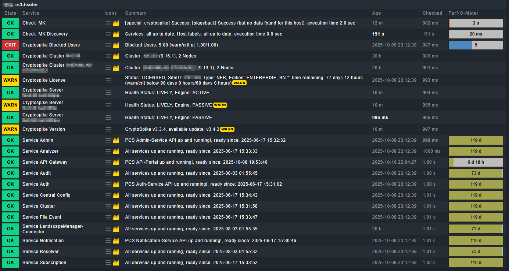

# ProLion Cryptospike 3.x

Datasource Program/Special Agent for monitoring ProLion Cryptospike 3.x
- Monitoring of service status (possible without login details)
- Monitoring of number of blocked users
- Monitoring of health status of storage server connection (*tested with NetApp Storage only*)
- Monitoring of Cryptospike licence

## Version History:

### 1.0.0:

- first release

## Configuration User Role CryptoSpike
create a new role "Monitoring" with the following settings:

- Cluster: Read
- StorageUser: Read
- Dashboard: View
- Audited Users: View
- Audited Users > Users: View
- Audited Users > Users > Reports: View
- Audited Users > Incidents: View
- Landscape: View
- Landscape > Storage Cluster: View 
- Landscape > Storage Cluster > Cluster > Details: View 
- Landscape > Storage Cluster > Server > Details: View 
- Landscape > Storage Cluster > Volume > Details: View 
- System: View
- System > Status: View
- Account Settings: View
- Date and Time: View

create an user and assign the role "Monitoring"

In Checkmk configure the datasource program (Setup > Agents > Other Integrations > Applications > ProLion Cryptospike)